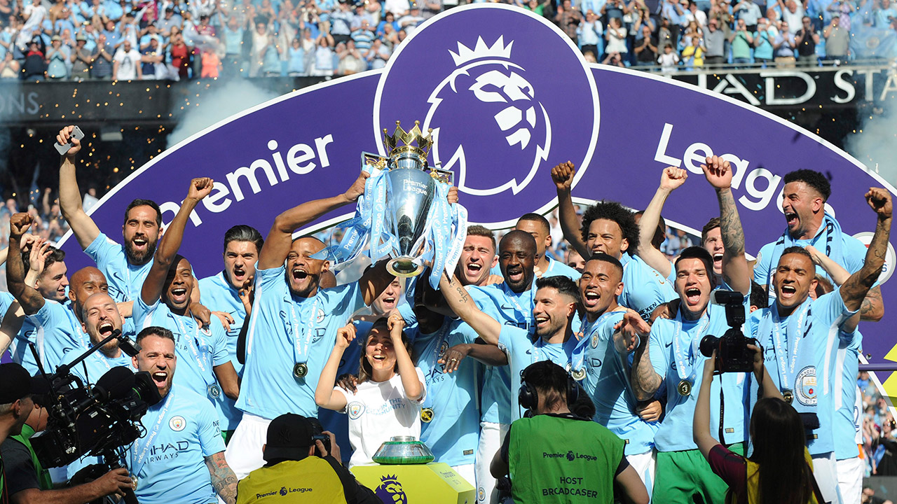
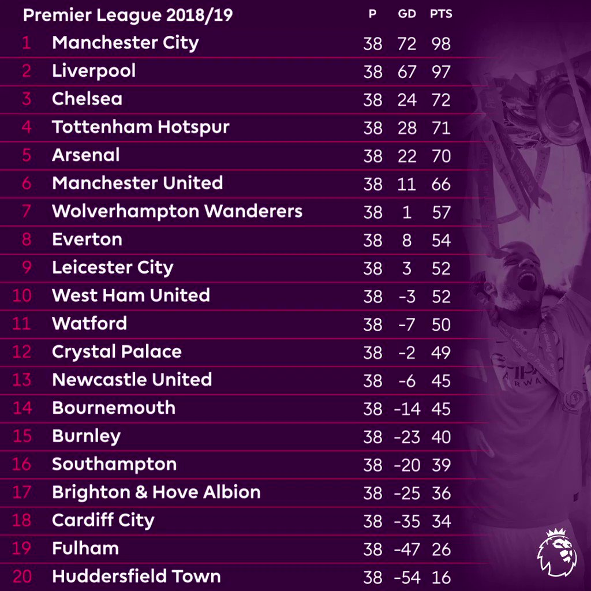

### Exploration of the relationship between different factors and game performance

{align="right" width=12%}

#### **Manchester City: Champion**

* 4th Premier League Title  

* 98 points   

* Liverpool: runners-up

 

{width=85%}

 

{width=85%}

 

### Collaborators
* Jasmine Zhang (yz4720) 

* Yuxin Zhang (yz4719) 

* Tianyou He (th3072)

* Xiaoyu Wu(xw2962)

* Xiaoyu Huang (xh2636)
